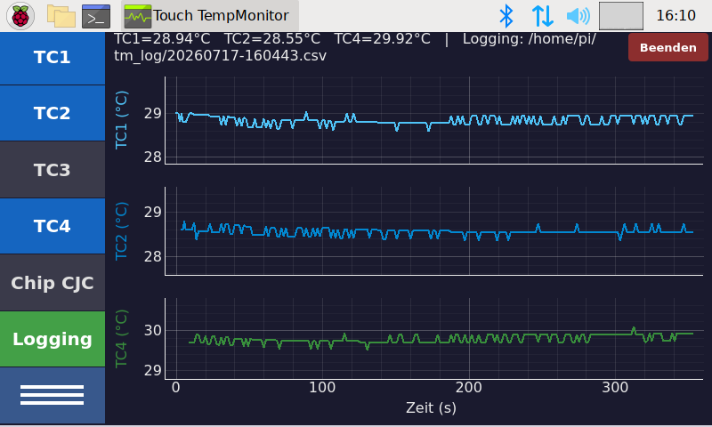
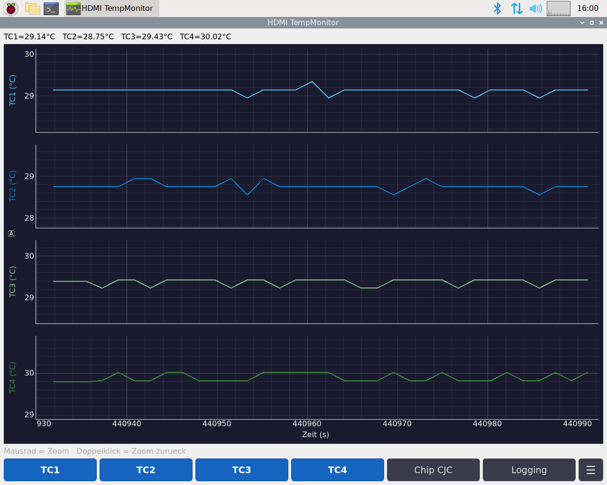

# 🌡️ Temperatur-Monitor

[](https://www.python.org/)
[](https://www.raspberrypi.com/)
[](https://www.riverbankcomputing.com/software/pyqt/)
[](LICENSE)

Multi-channel thermocouple temperature monitor for the **Raspberry Pi 3** with two **ADS1118** ADCs (SPI).  
Two production UIs share one measurement backend:

| App | Display | Entry point |
|-----|---------|-------------|
| **HDMI TempMonitor** | Eizo HDMI · 1280×1024 | `tm_pyqt_plot_app.py` |
| **Touch TempMonitor** | Official 7″ DSI touch · 800×448 | `tm_pyqt_touch_app.py` |

<p align="center">
  <br>
  <em>Touch TempMonitor — 7″ DSI, sidebar + live plot</em>
</p>

<p align="center">
  <br>
  <em>HDMI TempMonitor — desktop UI</em>
</p>

## ✨ Features

- 📈 Live multi-channel plots (PyQtGraph, OpenGL when available)
- 🧾 CSV logging with configurable missing-value policy
- 🖥️ HDMI desktop UI and dedicated 7″ touch UI
- 🔄 HDMI ↔ DSI display switch (`set_touch_display.sh` + reboot)
- 🧵 Hardware sampling in a background `QThread` (SPI exclusive — one app at a time)
- 📦 Shared modules for channels, settings, status, and display detection

## 🛠️ Hardware Requirements

- Raspberry Pi 3 (or compatible)
- Two Texas Instruments **ADS1118** ADCs on SPI
- Thermocouple front-end / TempMonitor PCB
- HDMI monitor and/or Raspberry Pi official 7″ touch display

Related driver work: [ads1118](https://github.com/viewinghood/ads1118) (MicroPython).

## 📦 Software Requirements

### Raspberry Pi (production)

| Item | Requirement |
|------|-------------|
| OS | Raspberry Pi OS **Bullseye** (Lite + manual desktop recommended) |
| Python | **3.9.x from apt** |
| Desktop | LightDM + LXDE |
| Packages | `python3-pyqt5`, `python3-pyqt5.qtopengl`, `python3-pyqtgraph`, `python3-numpy`, `python3-spidev` |

```bash
sudo apt-get update
sudo apt-get install -y \
  python3-pyqt5 python3-pyqt5.qtsvg python3-pyqt5.qtopengl \
  python3-pyqtgraph python3-numpy python3-spidev \
  libgl1-mesa-dri libgles2-mesa libegl1-mesa libmtdev1
```

Or from the project directory:

```bash
bash install_bullseye_gui.sh
bash install_bullseye_desktop.sh   # if desktop is not installed yet
```

Enable SPI (`dtparam=spi=on` in `/boot/config.txt`).

### Development PC (e.g. Windows)

| Item | Requirement |
|------|-------------|
| Role | Edit code and deploy via **SSH/SCP** — the app runs on the Pi |
| Python | 3.9+ optional (`pip install -r requirements.txt`) |
| SSH | Access to the Pi |

## 🚀 Installation on the Pi

1. Clone or copy this repository to `/home/pi/py/TempMonitor/dev/`.
2. Install GUI packages (see above).
3. Install desktop launchers:

```bash
cd ~/py/TempMonitor/dev
bash install_touch_desktop.sh
bash install_display_switch_desktop.sh
bash install_lxpanel_launcher.sh
```

4. Start **HDMI TempMonitor** or **Touch TempMonitor** from the desktop, or:

```bash
./start_tm_gui.sh              # HDMI
./start_tm_pyqt_touch_gui.sh   # Touch
```

## 🖥️ Display switch (HDMI ↔ Touch)

A reboot is required after switching.

```bash
cd ~/py/TempMonitor/dev
sudo bash set_touch_display.sh touch   # 7″ DSI
sudo reboot

# or
sudo bash set_touch_display.sh hdmi    # HDMI
sudo reboot
```

From a development PC: see [`HOWTO_terminal_display.md`](HOWTO_terminal_display.md).  
In-app: ☰ Settings → Display (target greyed out if not detected).

## 📁 Project layout

```
├── tm_pyqt_plot_app.py      # HDMI UI (production)
├── tm_pyqt_touch_app.py     # Touch UI (production)
├── tm_hw_worker.py          # SPI worker thread
├── spi_adc_tm_try4.py       # ADS1118 acquisition
├── set_touch_display.sh     # Display mode switch
├── docs/reports/            # Architecture & Bullseye notes
├── legacy/kivy/             # Earlier Kivy touch UI (reference only)
└── HOWTO_development.md     # File catalogue
```

Architecture details: [`docs/reports/REPORT-app-design.md`](docs/reports/REPORT-app-design.md)

## 📜 Legacy: Kivy

The earlier touch path lives under `legacy/kivy/`. It is **not** used in production; PyQt5 is the supported UI on Bullseye + X11.

## 📄 License

MIT License — see [LICENSE](LICENSE).

Copyright (c) 2026 Richard Heming

## 👥 Contributing

Contributions are welcome — please open a pull request.

## 📧 Contact

Questions and suggestions: open an issue in this repository.
