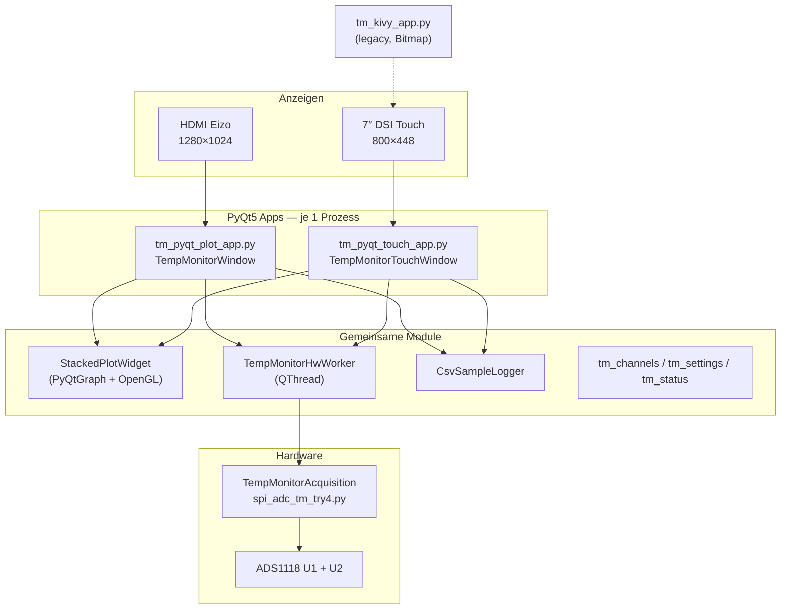
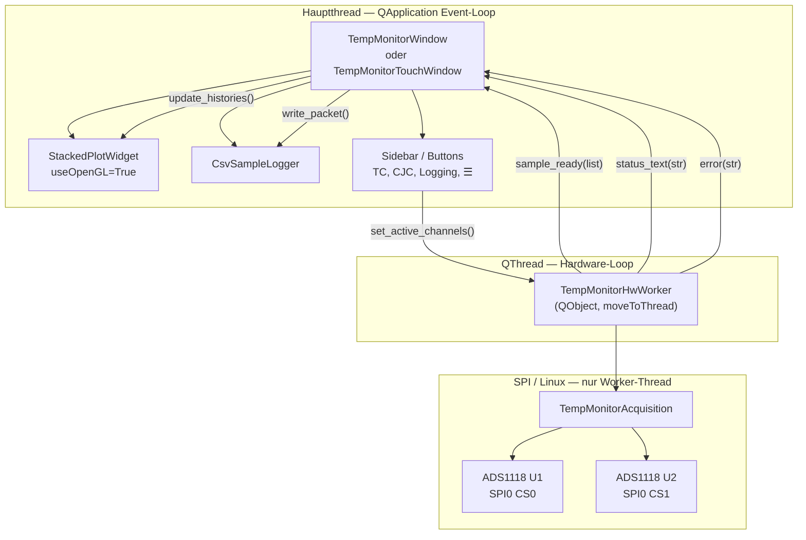
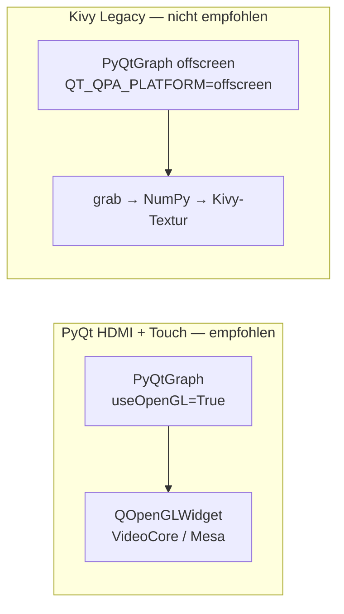
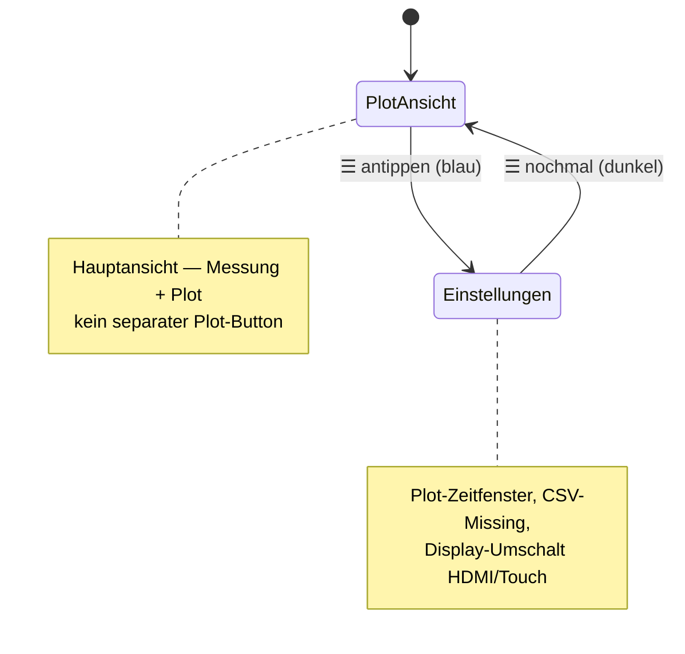
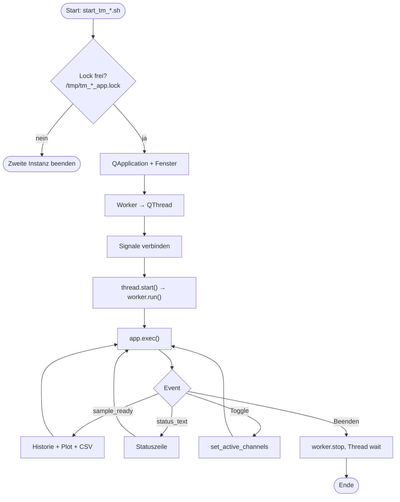
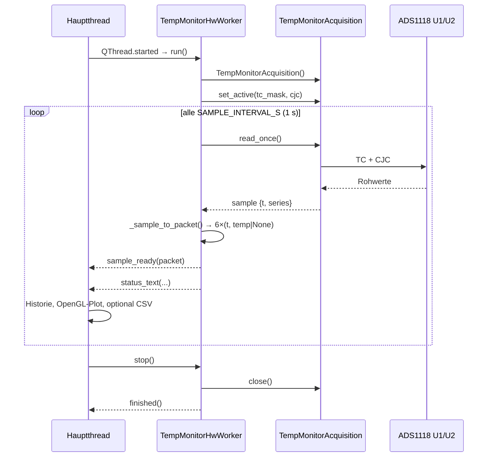
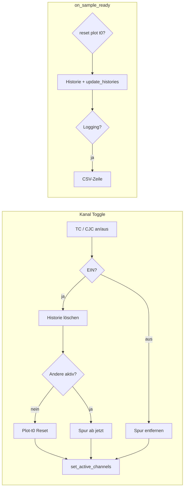
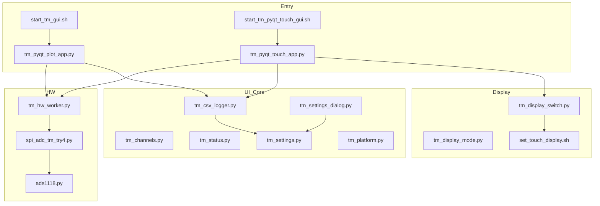

# TempMonitor — Architektur & App-Mechanik

**Stand:** 2026-07-10  
**Plattform:** Raspberry Pi 3, Raspberry Pi OS Bullseye, `/home/pi/py/TempMonitor/dev/`

---

## Kurzfassung

| UI | Datei | Display | Plot | Status |
|----|-------|---------|------|--------|
| **HDMI (Eizo)** | `tm_pyqt_plot_app.py` | 1280×1024 Desktop | PyQtGraph **OpenGL** | **Produktiv** |
| **7″ Touch (DSI)** | `tm_pyqt_touch_app.py` | 800×448 borderless | PyQtGraph **OpenGL** (shared `StackedPlotWidget`) | **Produktiv** |
| Kivy (alt) | `tm_kivy_app.py` | 7″ Touch | Offscreen-Bitmap-Brücke | Legacy |

Beide PyQt-Apps teilen dieselbe **Hardware-Schicht** (`TempMonitorHwWorker` + SPI), dieselbe **Plot-Logik** (`StackedPlotWidget`) und dieselbe **CSV-Logging-Schicht**.  
**Ein Prozess zur Zeit** — SPI ist exklusiv (`start_*.sh` beendet die andere Instanz).

**Schaubild (PNG):** [`REPORT-app-mechanik.png`](REPORT-app-mechanik.png) — alle Diagramme auf einer Seite.  
Neu erzeugen (Windows, Node/npx): `python build_app_mechanik_png.py`

---

## 1. Systemübersicht — zwei Frontends, ein Backend



| Startskript | Desktop-Icon |
|-------------|--------------|
| `start_tm_gui.sh` | `TempMonitor.desktop` |
| `start_tm_pyqt_touch_gui.sh` | `TempMonitor-Touch.desktop` |
| `start_tm_kivy_gui.sh` | `TempMonitor-Kivy.desktop` (Legacy) |

Display-Umschaltung: `set_touch_display.sh` (`touch` / `hdmi` / `status`) + Reboot.

---

## 2. Schichten und Threads (PyQt HDMI & Touch)



| Thread | Objekte | Aufgabe |
|--------|---------|---------|
| **Hauptthread** | Fenster, Plot, Logger, Buttons | UI, OpenGL-Plot, CSV, Touch/Maus |
| **QThread** | `TempMonitorHwWorker` | 1-Hz-Messloop, SPI, Signale |

**Regel:** Nur der Worker berührt SPI. UI → Worker nur über `set_active_channels()` (thread-sicher, `QMutex`).

**Touch-Bedienung:** X11 liefert Finger als Maus-Events; Qt-Buttons und PyQtGraph-Pan/Zoom funktionieren nativ (kein Kivy).

---

## 3. OpenGL / Rendering



| Pfad | OpenGL | Bemerkung |
|------|--------|-----------|
| `tm_pyqt_plot_app.py` | ✅ `useOpenGL=True` | Aktiv wenn apt-`python3-pyqt5.qtopengl` installiert |
| `tm_pyqt_touch_app.py` | ✅ (importiert `StackedPlotWidget`) | Gleicher Plot-Code |
| `pg_plot_kivy_widget.py` | ❌ | Offscreen ohne GL-Kontext |

Abschalten (Debug): `TM_DISABLE_OPENGL=1 start_tm_gui.sh`

Pi-Check (im dev-Verzeichnis):
```bash
cd ~/py/TempMonitor/dev
python3 -c "import tm_pyqt_plot_app as a; print('OpenGL', a._PG_USE_OPENGL)"
# Erwartung: OpenGL True
```

---

## 4. Touch-UI — Navigation (☰ Toggle)



Sidebar (7 Zeilen, gleiche Schriftgröße): TC1–4, Chip CJC, Logging (grün wenn an), ☰.

---

## 5. Programmablauf — Start bis Event-Loop



---

## 6. Messzyklus (1 Hz) — Sequenzdiagramm



---

## 7. Signal `sample_ready` — Datenformat

**Typ:** `pyqtSignal(list)` — **6 Einträge**, Index = Kanal.

| Index | Kanal | Hardware |
|-------|-------|----------|
| 0 | TC1 | U1 AIN0–AIN1 |
| 1 | TC2 | U1 AIN2–AIN3 |
| 2 | TC3 | U2 AIN0–AIN1 |
| 3 | TC4 | U2 AIN2–AIN3 |
| 4 | U1 CJC | Chip-Temp U1 |
| 5 | U2 CJC | Chip-Temp U2 |

Jeder Eintrag: **`(zeit_s, temp_c)`** — `temp_c = None` wenn inaktiv/offen.

### Signale & Slots

| Signal / Slot | Richtung | Inhalt |
|---------------|----------|--------|
| `sample_ready` | Worker → UI | 6-Kanal-Paket |
| `status_text` | Worker → UI | z. B. `TC1=28.76°C` |
| `error` | Worker → UI | SPI-Fehler |
| `finished` | Worker → UI | Loop Ende |
| `set_active_channels` | UI → Worker | TC-Maske + CJC |
| `stop()` | UI → Worker | Loop + SPI schließen |

---

## 8. UI-Logik — Kanäle, Plot-Zeit, Logging



| Ebene | Variable | Bedeutung |
|-------|----------|-----------|
| Worker | `_t0` | Absoluter Messstart |
| UI-Plot | `_plot_t0` | Anzeige-Offset; Reset wenn alle Kanäle aus waren |
| CSV | Worker-Zeit | Monoton, unabhängig von Plot-Reset |

---

## 9. Modul-Map — Dateien und Rollen



| Datei | Rolle |
|-------|--------|
| `tm_pyqt_plot_app.py` | HDMI-UI, `StackedPlotWidget`, OpenGL-Config, `TempMonitorWindow` |
| `tm_pyqt_touch_app.py` | Touch-UI 800×448, Sidebar, ☰-Toggle, importiert Plot aus obigem Modul |
| `tm_hw_worker.py` | `TempMonitorHwWorker` — QThread, Signale, Mutex |
| `spi_adc_tm_try4.py` | `TempMonitorAcquisition`, 1 Hz, TC + CJC |
| `ads1118.py` | Low-Level SPI-Treiber |
| `tm_channels.py` | Kanalnamen, Farben, `MAX_HISTORY` |
| `tm_csv_logger.py` | CSV unter `~/tm_log/` |
| `tm_settings.py` / `tm_settings_dialog.py` | Plot-Fenster, Missing-Werte |
| `set_touch_display.sh` | Boot-Config HDMI ↔ Touch |

**Legacy (Referenz):** `tm_kivy_app.py`, `tm_kivy_hw.py`, `tm_kivy_screens.py`, `pg_plot_kivy_widget.py`

---

## 10. CSV-Logging

- Pfad: `~/tm_log/YYYYMMDD-HHMMSS.csv`
- Header: `Time,TC1,TC2,TC3,TC4,U1,U2`
- Start nur wenn ≥1 Sensor aktiv; Stopp wenn letzter Sensor aus oder App-Ende
- Inaktive Spalten während Logging: konfigurierbar (`nan`, `#N/A`, …)

---

## 11. Start / Singleton / SPI-Exklusivität

```bash
# HDMI
~/py/TempMonitor/dev/start_tm_gui.sh

# 7″ Touch
~/py/TempMonitor/dev/start_tm_pyqt_touch_gui.sh
```

| Lock-Datei | App |
|------------|-----|
| `/tmp/tm_pyqt_plot_app.lock` | HDMI |
| `/tmp/tm_pyqt_touch_app.lock` | Touch |
| `/tmp/tm_kivy_app.lock` | Kivy (legacy) |

Touch-Starter beendet automatisch laufende HDMI- oder Kivy-Instanz (SPI freigeben).

---

## 12. Warum PyQt-only statt Kivy-Hybrid?

| Kivy + Bitmap | PyQt-only (aktuell) |
|---------------|---------------------|
| Zwei GUI-Stacks | Eine Qt-Event-Loop |
| Offscreen → Textur (CPU) | OpenGL direkt im Fenster |
| Queue / Clock-Polling | Qt Signals/Slots |
| Touch-Buttons fehleranfällig | Native Qt Touch (= Maus) |

Kivy war sinnvoll auf Stretch ohne Desktop; unter Bullseye + X11 ist **PyQt5 die bessere Wahl** für Touch und HDMI.
